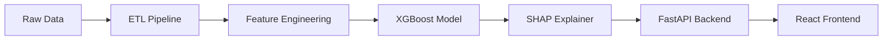

# Credit Risk Scoring System

[](https://www.python.org/downloads/)
[](https://opensource.org/licenses/MIT)
[](https://github.com/psf/black)

> An explainable machine learning system for credit risk scoring, designed to predict loan default probability while meeting banking regulatory requirements (EBA guidelines, Basel III).

## 📋 Overview

This project implements an end-to-end credit risk scoring pipeline that predicts the probability of default for personal loan applicants. The system is built with a **hybrid Data + Multiplatform Development** profile in mind, combining:

- **Data Science**: XGBoost + SHAP for explainable predictions
- **Backend**: FastAPI for model serving
- **Frontend**: React dashboard for loan officers

### Business Context

The Spanish banking sector (IBEX 35: Santander, BBVA, CaixaBank, Sabadell) operates under strict regulatory frameworks:

- **EBA Guidelines on Loan Origination**: Require explainable AI models
- **Basel III / IFRS 9**: Mandate robust PD (Probability of Default) estimation
- **Bank of Spain**: Supervises risk models and requires audit trails
- **GDPR**: Article 22 grants applicants the "right to explanation" for automated decisions

This project addresses these requirements by prioritizing **model interpretability** over pure predictive performance.

### Key Trade-off: False Positives vs False Negatives

| Scenario | Business Impact | Cost |
|----------|----------------|------|
| **False Positive** (reject good client) | Lost revenue + reputational damage | Medium |
| **False Negative** (approve bad client) | Default loss + regulatory capital impact | **High** |

The model is tuned to minimize false negatives while maintaining acceptable false positive rates.

## 🏗️ Architecture



*Detailed architecture diagram will be added in Phase 4.*

## 🚀 Installation

### Prerequisites

- Python 3.9 or higher
- pip
- Git

### Steps

```bash
git clone https://github.com/YOUR_USERNAME/credit-risk-scoring.git
cd credit-risk-scoring

python -m venv venv
source venv/bin/activate  # On Windows: venv\Scripts\activate

pip install -r requirements.txt
cp .env.example .env
```

## 📊 Dataset

*To be detailed in Phase 1.*

Initial dataset: **Freddie Mac Single-Family Loan-Level Dataset** (publicly available) or similar credit risk dataset.

## 🔬 Methodology

*To be expanded in Phases 2-3.*

| Phase | Description |
|-------|-------------|
| Phase 1 | ETL and Exploratory Data Analysis (EDA) |
| Phase 2 | Feature engineering and model training |
| Phase 3 | Explainability with SHAP and regulatory validation |
| Phase 4 | REST API with FastAPI |
| Phase 5 | React frontend and final documentation |

## 📈 Results

*To be completed in Phase 3.*

| Metric | Value |
|--------|-------|
| ROC-AUC | TBD |
| Precision | TBD |
| Recall | TBD |
| F1-Score | TBD |

## ⚠️ Limitations

*To be updated in Phase 5.*

- Synthetic/public dataset (not production banking data)
- No temporal validation (point-in-time data)
- Simplified feature set compared to real banking systems

## 🔄 Next Steps

- [ ] Deploy to cloud (AWS/GCP)
- [ ] Add model monitoring (data drift detection)
- [ ] Implement A/B testing framework
- [ ] Add stress testing scenarios

## 📂 Project Structure

```
credit-risk-scoring/
├── data/
│   ├── raw/              # Original datasets (not tracked)
│   └── processed/        # Cleaned datasets (not tracked)
├── notebooks/            # Jupyter notebooks for EDA
├── src/
│   ├── data/             # Data processing modules
│   ├── models/           # Model training and evaluation
│   └── api/              # FastAPI backend
├── tests/                # Unit and integration tests
├── docs/                 # Additional documentation
├── requirements.txt      # Python dependencies
└── README.md             # This file
```

## 🧪 Testing

```bash
pytest
pytest --cov=src
```


## 📞 Contact

*Pablo Sosa* - pbl2424sosa@gmail.com

Project Link: [github.com/Psosa3232/credit-risk-scoring](https://github.com/Psosa3232/credit-risk-scoring)